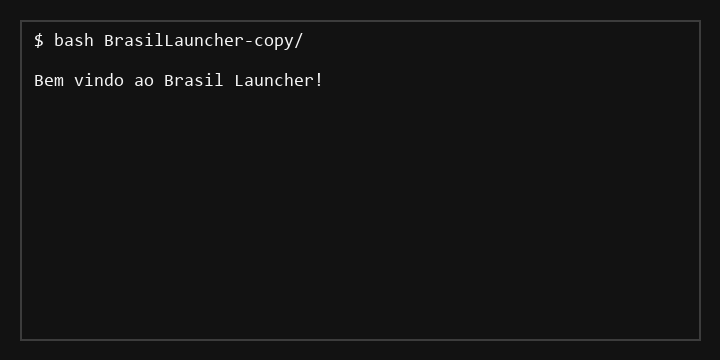

# Brasil Launcher

Launcher de Minecraft para Windows escrito em C# targeting .NET 10 Windows. Este README assume que o usuário fará clone do repositório a partir de `https://github.com/bryandevelopments/BrasilLauncher-copy.git` usando Git Bash e executará o código localmente.

## Visão Geral Técnica

`BrasilLauncher` é um utilitário de linha de comando que encapsula a biblioteca `CmlLib.Core` para: autenticar via Microsoft, resolver metadados de versões do Minecraft, baixar runtime/assets e orquestrar o processo do jogo.

Arquitetura:
- `Program.cs` — entrypoint assíncrono, controla fluxo do usuário e interações via `Spectre.Console`.
- `Game/Minecraft.cs` — camada de domínio de execução do Minecraft; usa `MinecraftLauncher`, `MLaunchOption`, `InstallAndBuildProcessAsync` e `BuildProcessAsync`.
- `Game/MinecraftAuth.cs` — abstração mínima do handler de login Microsoft (`JELoginHandler`) que devolve `MSession` autenticada.
- `Interface/Menus.cs` — wrappers de prompts para `Spectre.Console.Ask`, `Confirm`, `SelectionPrompt`.
- `BrasilLauncher.csproj` — configura target, SDK, pacotes e habilita WinForms para compatibilidade com dependências nativas do Windows.

## Demonstração

A seguir está um GIF demonstrando o fluxo de execução do launcher no terminal. Ele exibe o prompt de login, a seleção de versão e a inicialização do jogo.



## Repositório e clone

Clone o projeto com Git Bash:

```bash
git clone https://github.com/bryandevelopments/BrasilLauncher-copy.git
cd BrasilLauncher-copy
```

> Observação: se o repositório for clonado para um caminho com espaços, use aspas quando navegar no Git Bash.

## Dependências e SDK

- `Microsoft.NET.Sdk`
- Target framework: `net10.0-windows`
- `UseWindowsForms` habilitado para compatibilidade com APIs Windows necessárias ao runtime de `CmlLib.Core`.
- Pacotes NuGet:
  - `CmlLib.Core` v4.0.6
  - `CmlLib.Core.Auth.Microsoft` v3.3.1
  - `Spectre.Console` v0.55.2

Requisitos de ambiente:
- Windows 10/11 compatível
- .NET 10 SDK instalado
- Conexão com a Internet para baixar assets e autenticar Microsoft
- Conta Microsoft válida para login online

## Fluxo de execução

1. O `Main` cria instâncias de `Minecraft` e `MinecraftAuth`.
2. Exibe prompt usando `AnsiConsole.MarkupLine` e `Menus.Confirmar`.
3. Se o usuário escolher login, `MinecraftAuth.FazerLogin()` chama `JELoginHandler.Authenticate()`.
4. Caso contrário, `MSession.CreateOfflineSession(nome)` gera sessão offline.
5. `Minecraft.PerguntarVersao()` consulta `launcher.GetAllVersionsAsync()` e constrói um `SelectionPrompt<string>` com todas as versões.
6. O usuário confirma download; se sim, `InstallAndBuildProcessAsync` baixa e configura a versão; senão, `BuildProcessAsync` usa arquivos existentes.
7. Um processo do jogo é criado e iniciado com `game.Start()` dentro de um `AnsiConsole.Status().Start(...)`.

## Como compilar e executar localmente

No Git Bash, execute:

```bash
cd BrasilLauncher-copy
dotnet restore
dotnet build -c Debug
```

Para executar:

```bash
dotnet run --project BrasilLauncher.csproj
```

### Parâmetros incorporados

O binário usa memória máxima fixa no launcher:
- `MaximumRamMb = 4096`

Ajuste este valor em `Game/Minecraft.cs` se você quiser limitar ou expander a RAM disponível.

## Cenários de uso

### Login Microsoft

- `MinecraftAuth.FazerLogin()` abre o fluxo de autenticação `JELoginHandler`.
- Após autenticação, retorna uma sessão `MSession` contendo `Username`, `AccessToken`, `ClientToken` e demais cookies necessários.

### Offline

- `MSession.CreateOfflineSession(nome)` gera sessão offline sem validação de credenciais.
- Útil para testes ou acesso rápido quando a conta Microsoft não estiver disponível.

### Baixar versão

- `InstallAndBuildProcessAsync(versao, options)` baixa automaticamente `client.jar`, assets, bibliotecas e metadados necessários.
- Se `baixar == false`, o launcher espera encontrar os arquivos localmente para a versão selecionada.

## Comandos avançados

### Debug e release

```bash
dotnet build -c Release
```

### Publicar executável Windows x64

```bash
dotnet publish -c Release -r win-x64 --self-contained false /p:PublishSingleFile=false
```

Use `win-x86` ou `win-arm64` conforme a plataforma desejada.

## Como funciona o arquivo `.csproj`

O `BrasilLauncher.csproj` declarou:

```xml
<PropertyGroup>
  <OutputType>Exe</OutputType>
  <TargetFramework>net10.0-windows</TargetFramework>
  <ImplicitUsings>enable</ImplicitUsings>
  <UseWindowsForms>true</UseWindowsForms>
  <Nullable>enable</Nullable>
</PropertyGroup>
```

Isso significa:
- Aplicativo Console com saída executável
- Usa APIs Windows para compatibilidade com bibliotecas do launcher
- Habilita `Nullable` para melhorar robustez de tipos
- Importações implícitas reduzem boilerplate em arquivos C#.

## Observações de implementação

- `Minecraft.MinecraftLauncher` é o ponto de entrada para o runtime do jogo. A biblioteca `CmlLib.Core` abstrai downloads, parsing de manifest e montagem de linha de comando.
- O `Process? game` é instanciado dinamicamente. Caso `game` seja `null`, o launcher falhará no `game.Start()`.
- `AnsiConsole.Status().Start("$Init minecraft {versao}", ctx => { Thread.Sleep(2000); game.Start(); });` usa status de terminal para indicar progresso, mas não aguarda a conclusão do processo do jogo.
- `Menus.Escolher` foi implementado mas não é utilizado no fluxo atual; poderia ser reutilizado para prompts de escolha mais avançados.

## Possíveis melhorias técnicas

- implementar tratamento de erros robusto em `FazerLogin`, `PerguntarVersao` e `AbrirMinecraft`
- validar se a versão já está disponível localmente antes de chamar `InstallAndBuildProcessAsync`
- adicionar argumento de linha de comando para selecionar versão sem prompt interativo
- extrair `MaximumRamMb` para configuração externa (`appsettings.json` ou argumentos CLI)
- suportar `self-contained` e publicação cross-platform se a dependência Windows for removida

## Troubleshooting

- `dotnet restore` falha: verifique a instalação do .NET 10 SDK e a conectividade com o feed NuGet.
- autenticação Microsoft falha: confirme que o Windows permite pop-ups do login e que a conta está ativa.
- versão não encontrada: `GetAllVersionsAsync()` usa manifest público do Minecraft; problemas de DNS ou bloqueio de rede podem impedir listagem.

## Executando via Git Bash

No Git Bash, assegure-se de usar caminhos POSIX ou envolvendo nome do diretório entre aspas:

```bash
cd "/c/Users/Bryan/source/repo/Minecraft Serie/BrasilLauncher"
dotnet run --project BrasilLauncher.csproj
```

Se quiser forçar execução com .NET CLI do Windows, use o caminho completo do `dotnet.exe`:

```bash
"/c/Program Files/dotnet/dotnet.exe" run --project BrasilLauncher.csproj
```

